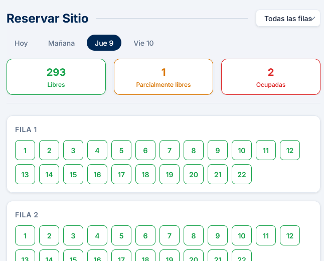
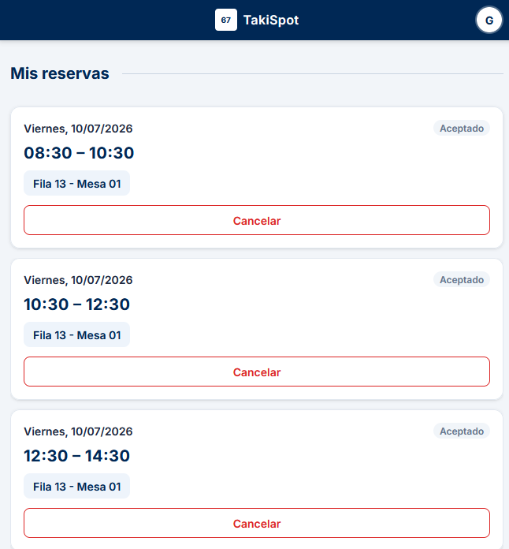
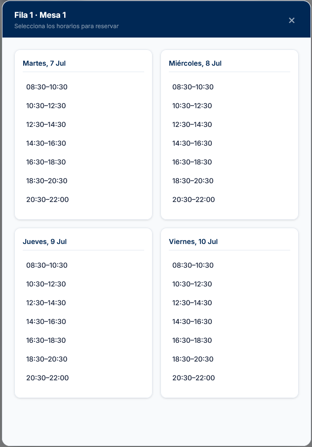

# TakiSpot

Reserva de mesas en la biblioteca UCAM con visualización en tiempo real. Interfaz moderna sobre la API de [TakeASpot](https://reservas.ucam.edu).

**Demo en vivo:** [biblio-uca-mnodejs.vercel.app](https://biblio-uca-mnodejs.vercel.app)

---

## Capturas

| Mapa interactivo | Mis reservas |
|:---:|:---:|
|  |  |
| Disponibilidad en tiempo real por fila y mesa | Gestiona, cancela y haz check-in de tus reservas |

| Selección de horarios |
|:---:|
|  |
| Reserva una mesa en varias franjas y días a la vez |

---

## Funcionalidades

- **Mapa interactivo** — 165 mesas con estado en tiempo real (libre, parcial, ocupada)
- **Reservas simples y múltiples** — una mesa en varias franjas, o varias mesas a la vez
- **Multi-cuenta** — guarda varias cuentas UCAM y cambia entre ellas sin volver a iniciar sesión
- **Check-in** — confirma tu presencia desde la propia app
- **Sesión pública** — el mapa es visible sin login; las reservas requieren autenticación
- **Responsive** — sidebar en escritorio, navbar compacta en móvil
- **Analytics** — eventos GA4 opcionales (login, reservas, check-in…)

---

## Stack

| Capa | Tecnología |
|------|------------|
| Framework | [Next.js 16](https://nextjs.org) (App Router) |
| UI | React 19 · Tailwind CSS 4 |
| Sesión | [iron-session](https://github.com/vvo/iron-session) (cookies HttpOnly cifradas) |
| API | TakeASpot (`reservas.ucam.edu`) |
| Deploy | [Vercel](https://vercel.com) |

---

## Inicio rápido

### Requisitos

- Node.js 20+
- Cuenta UCAM con acceso a TakeASpot

### Instalación

```bash
git clone https://github.com/bollicaolover/biblioUCAMnodejs.git
cd biblioUCAMnodejs
npm install
cp .env.example .env.local   # rellena las variables
npm run dev
```

Abre [http://localhost:3000](http://localhost:3000).

### Variables de entorno

Crea `.env.local` a partir de `.env.example`:

| Variable | Descripción |
|----------|-------------|
| `SESSION_SECRET` | Secreto para cifrar cookies (mín. 32 caracteres aleatorios) |
| `PUBLIC_UCAM_EMAIL` | Email UCAM para la sesión pública del mapa (solo lectura) |
| `PUBLIC_UCAM_PASSWORD` | Contraseña de esa cuenta |
| `NEXT_PUBLIC_GA_MEASUREMENT_ID` | ID de medición GA4 *(opcional)* |

> La sesión pública solo se usa para **consultar disponibilidad**. Crear o cancelar reservas siempre requiere el login del usuario.

---

## Estructura del proyecto

```
src/
├── app/
│   ├── api/          # Rutas API (auth, bookings, slots, services)
│   └── page.tsx      # Página principal
├── components/
│   ├── auth/         # Login y gestión de cuentas
│   ├── booking/      # Modal de reserva y panel de mis reservas
│   ├── map/          # Mapa interactivo de la biblioteca
│   └── analytics/    # Google Analytics
├── lib/
│   ├── takeaspot/    # Cliente HTTP, sesión y login contra TakeASpot
│   ├── booking/      # Lógica de check-in y visualización
│   └── constants/    # Horarios, mesas y configuración
└── types/            # Tipos TypeScript
```

---

## Límites del sistema TakeASpot

- Máximo **6 reservas por día**
- Franjas horarias de 2 horas (08:30 – 22:30)
- Las sesiones expiran tras ~4,8 h de inactividad

---

## Scripts

```bash
npm run dev      # Servidor de desarrollo
npm run build    # Build de producción
npm run start    # Servidor de producción
npm run lint     # ESLint
```

---

## Aviso

Este proyecto **no está afiliado a la UCAM ni a TakeASpot**. Es una herramienta independiente que consume la API pública del sistema de reservas universitario. Úsala bajo tu propia responsabilidad.

---

## Autor

Hecho por **G1904** · v6.7
